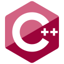
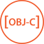
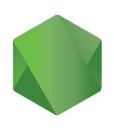

<!--
**CTzatzakis/CTzatzakis** is a ✨ _special_ ✨ repository because its `README.md` (this file) appears on your GitHub profile.

Here are some ideas to get you started:

- 🔭 I’m currently working on ...
- 🌱 I’m currently learning ...
- 👯 I’m looking to collaborate on ...
- 🤔 I’m looking for help with ...
- 💬 Ask me about ...
- 📫 How to reach me: ...
- 😄 Pronouns: ...
- ⚡ Fun fact: ...
-->

<!--  -->

  ---

&nbsp;&nbsp;

Hi, I'm Chris, an Informatics & Communications Engineer, InfoSec Analyst, and Art enthusiast. I am always open to discussing new projects and interesting ideas. Feel free to reach out with any questions.

### Languages

<code></code>
<code></code>
<code></code>
<code></code>
<code></code>
<code></code>

### + Some other technologies I use

<code></code>
<code></code>
<code></code> 
<code></code> 
<code></code>
<code></code>
<code></code>
<code></code> 
<code></code> 
<code></code> 

  ---
<code></code>
<code></code>
<code></code>
<code></code>
<code></code>
<code></code>
<code></code>
<code></code>
<code></code>
<code></code>

  ---

<!--
### Cybersecurity Projects
-->

